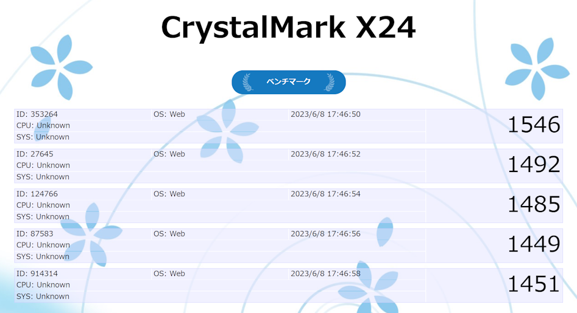

# 課題04 LINE風アプリ

 

## ①課題内容（どんな作品か）
- CrystalMark X24 Firebase活用超簡易Web版

## ②工夫した点・こだわった点
- 先週の課題をベースに、ベンチマーク結果保存機能をローカルストレージからFirebaseに変更しました。

## ③難しかった点・次回トライしたいこと(又は機能)
- ベンチマークスコアでソートする機能や分析する機能を作ります。
- Web版では取得することができないため、CPUなどのシステム情報はいったんUnknownとしました。
- 今後、ネイティブクライアントを作り、サーバーと通信してベンチマーク結果を保存する仕組みを作ります。

## ④質問・疑問・感想、シェアしたいこと等なんでも
- Firebaseで1億レコードのベンチマーク結果を保存するのは難しそうなので、別のアプローチを考えます。
